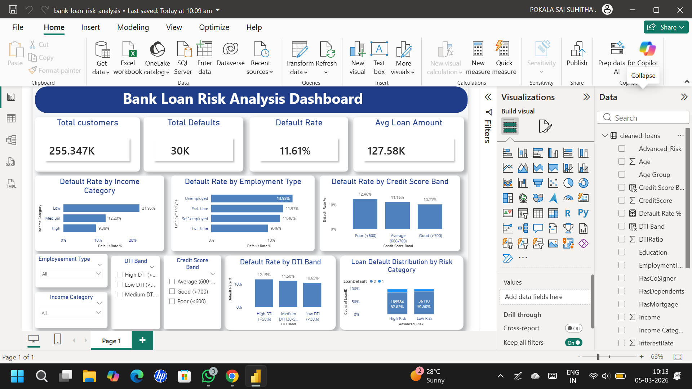

# bank-loan-risk-analysis
End-to-end data analytics project analyzing bank loan default risk using Python, SQL, and Power BI.
# Bank Loan Risk Analysis

## Project Overview

This project analyzes bank loan data to identify patterns and factors that influence loan default risk.  
The goal of the analysis is to understand borrower behavior and identify high-risk loan applicants using data analysis and visualization.

The project demonstrates an **end-to-end data analytics workflow** using Python, SQL, and Power BI.

---

## Tools & Technologies

- Python
- Pandas
- NumPy
- Matplotlib
- Seaborn
- SQL (MySQL)
- Power BI
- Excel

---

## Dataset

The dataset contains approximately **255,000 loan records** including borrower information such as:

- Age
- Income
- Credit Score
- Employment Type
- Loan Amount
- Debt-to-Income Ratio (DTI)
- Loan Default Status

Due to GitHub file size limitations, the full dataset is not included in this repository.

---

## Project Workflow

### 1. Data Cleaning and Preparation (Python)

- Loaded dataset using **Pandas**
- Checked and handled missing values
- Created additional features:
  - Income Category
  - Age Group
  - Risk Level

---

### 2. Exploratory Data Analysis (EDA)

Using **Matplotlib and Seaborn**, the following analyses were performed:

- Distribution of income and credit score
- Default patterns across borrower groups
- Correlation analysis using heatmaps
- Boxplots comparing default vs non-default customers

---

### 3. SQL Analysis

SQL queries were used to analyze the data and validate insights:

- Calculated overall loan default rate
- Segmented borrowers by employment type
- Compared default rates across income categories
- Identified high-risk borrower groups

---

### 4. Power BI Dashboard

An interactive **Power BI dashboard** was created to visualize key insights.

The dashboard includes:

- Total Customers
- Total Defaults
- Default Rate
- Average Loan Amount
- Default Rate by Income Category
- Default Rate by Employment Type
- Default Rate by Credit Score Band
- Default Rate by DTI Band
- Loan Default Distribution by Risk Category

Interactive **slicers** allow filtering by borrower segments.

---

## Key Insights

- Overall loan default rate is approximately **11.6%**
- Borrowers with **lower income levels** have higher default risk
- **Unemployed customers** show higher default rates
- Borrowers with **poor credit scores (<600)** are significantly more likely to default
- Higher **Debt-to-Income ratios** moderately increase default probability

---

## Dashboard

The Power BI dashboard provides a visual overview of loan risk factors and borrower segmentation.

It helps identify patterns in borrower behavior and supports risk assessment decisions.

---

## Repository Structure

bank-loan-risk-analysis
│
├── bank_loan_risk_analysis.ipynb
├── bank_loan_risk_analysis.pbix
├── loan_analysis_queries.sql
├── dashboard_preview.png
└── README.md

---

## Author

**Sai Suhitha Pokala**

Aspiring Data Analyst interested in data analytics, financial analytics, and business intelligence.

